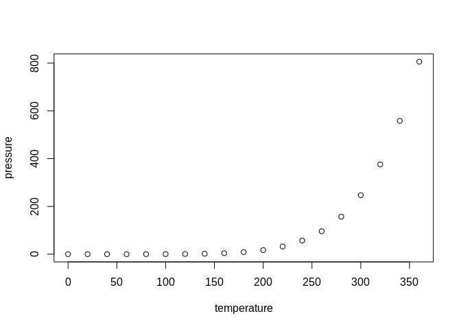

example
================
Isaac Petersen
4/16/2022

-   <a href="#1-r-markdown" id="toc-1-r-markdown">1 R Markdown</a>
-   <a href="#2-including-plots" id="toc-2-including-plots">2 Including
    Plots</a>
-   <a href="#3-headings" id="toc-3-headings">3 Headings</a>
    -   <a href="#31-subheading" id="toc-31-subheading">3.1 Subheading</a>
        -   <a href="#311-subsubheading" id="toc-311-subsubheading">3.1.1
            Subsubheading</a>
-   <a href="#4-lists" id="toc-4-lists">4 Lists</a>
    -   <a href="#41-unordered-lists" id="toc-41-unordered-lists">4.1 Unordered
        Lists</a>
    -   <a href="#42-ordered-lists" id="toc-42-ordered-lists">4.2 Ordered
        Lists</a>
-   <a href="#5-blockquotes" id="toc-5-blockquotes">5 Blockquotes</a>
-   <a href="#6-emphasis" id="toc-6-emphasis">6 Emphasis</a>
-   <a href="#7-codesyntax-highlighting"
    id="toc-7-codesyntax-highlighting">7 Code/Syntax Highlighting</a>
-   <a href="#8-math-formulas" id="toc-8-math-formulas">8 Math Formulas</a>
-   <a href="#9-links" id="toc-9-links">9 Links</a>
-   <a href="#10-footnotes" id="toc-10-footnotes">10 Footnotes</a>
-   <a href="#11-symbols" id="toc-11-symbols">11 Symbols</a>
    -   <a href="#111-arrows" id="toc-111-arrows">11.1 Arrows</a>
    -   <a href="#112-dashes-and-hyphens" id="toc-112-dashes-and-hyphens">11.2
        Dashes and Hyphens</a>
-   <a href="#12-session-info" id="toc-12-session-info">12 Session Info</a>
    -   <a href="#121-rstudio-version" id="toc-121-rstudio-version">12.1 Rstudio
        Version</a>

The `.md` and `.html` files are generated from the `.Rmd` file. Make
sure to make any edits to the `.Rmd` file (not the `.md` and `.html`
files).

# 1 R Markdown

This is an R Markdown document. Markdown is a simple formatting syntax
for authoring HTML, PDF, and MS Word documents. For more details on
using R Markdown see <http://rmarkdown.rstudio.com>.

When you click the **Knit** button a document will be generated that
includes both content as well as the output of any embedded R code
chunks within the document.

Add a new chunk by clicking the *Insert Chunk* button on the toolbar or
by pressing *Ctrl+Alt+I*.

When you save the notebook, an HTML file containing the code and output
will be saved alongside it (click the *Preview* button or press
*Ctrl+Shift+K* to preview the HTML file).

The preview shows you a rendered HTML copy of the contents of the
editor. Consequently, unlike *Knit*, *Preview* does not run any R code
chunks. Instead, the output of the chunk when it was last run in the
editor is displayed.

You can embed an R code chunk like this:

``` r
summary(cars)
```

    ##      speed           dist       
    ##  Min.   : 4.0   Min.   :  2.00  
    ##  1st Qu.:12.0   1st Qu.: 26.00  
    ##  Median :15.0   Median : 36.00  
    ##  Mean   :15.4   Mean   : 42.98  
    ##  3rd Qu.:19.0   3rd Qu.: 56.00  
    ##  Max.   :25.0   Max.   :120.00

# 2 Including Plots

You can also embed plots, for example:

<!-- -->

Note that the `echo = FALSE` parameter was added to the code chunk to
prevent printing of the R code that generated the plot.

# 3 Headings

## 3.1 Subheading

### 3.1.1 Subsubheading

#### 3.1.1.1 Subsubsubheading

# 4 Lists

To add another element in a list while preserving the continuity of the
list, indent the element four spaces or one tab.

## 4.1 Unordered Lists

To create an unordered list, add dashes (-), asterisks (\*), or plus
signs (+) in front of line items.

-   one item
-   one item
-   one item
    -   one more item
    -   one more item
    -   one more item
        -   lower level
            -   sub-item 1
            -   sub-item 2

## 4.2 Ordered Lists

1.  the first item
    1.  test
    2.  test
        1.  new test
        2.  new test
2.  the second item
    1.  test
    2.  test
3.  the third item
    -   one unordered item
        -   subitem
    -   one unordered item
4.  fourth item
    1.  test
    2.  test
    3.  test

# 5 Blockquotes

> Dorothy followed her through many of the beautiful rooms in her
> castle.
>
> Continued…

# 6 Emphasis

This text is **bolded text**. This text is *italicized text*. This text
is ***bolded and italicized text***. This text is <mark>highlighted
text</mark>. This text is
<mark style="background-color: lightblue">highlighted text in a
different color</mark>. This text is `unicode text`. This text is
<code><i>code in italics;</i> this text is <b>code is bold</b></code>.
This text is ~~strikethrough text~~.

# 7 Code/Syntax Highlighting

To use syntax highlighting to display code without running the code:

``` r
summary(cars)
```

or

``` r
summary(cars)
```

# 8 Math Formulas

Inline:

This is the formula:
.
Solve for
.

Separate line:


# 9 Links

[I’m an inline-style link](https://www.google.com)

[I’m an inline-style link with
title](https://www.google.com "Google's Homepage")

[I’m a reference-style link](https://www.mozilla.org)

[I’m a relative reference to a repository file](../blob/master/LICENSE)

[You can use numbers for reference-style link
definitions](http://slashdot.org)

URLs and URLs in angle brackets will automatically get turned into
links. <http://www.example.com> or <http://www.example.com>

Some text to show that the reference links can follow later.

# 10 Footnotes

Here is a simple footnote[^1].

A footnote can also have multiple lines[^2].

You can also use words, to fit your writing style more closely[^3].

# 11 Symbols

## 11.1 Arrows

-   left arrow: ← ←
-   upward arrow: ↑ ↑
-   right arrow: → →
-   downward arrow: ↓ ↓

## 11.2 Dashes and Hyphens

-   hyphen: -
-   en dash: –
-   em dash: —

# 12 Session Info

``` r
sessionInfo()
```

    ## R version 4.2.0 (2022-04-22)
    ## Platform: x86_64-pc-linux-gnu (64-bit)
    ## Running under: Ubuntu 20.04.4 LTS
    ## 
    ## Matrix products: default
    ## BLAS:   /usr/lib/x86_64-linux-gnu/blas/libblas.so.3.9.0
    ## LAPACK: /usr/lib/x86_64-linux-gnu/lapack/liblapack.so.3.9.0
    ## 
    ## locale:
    ##  [1] LC_CTYPE=C.UTF-8       LC_NUMERIC=C           LC_TIME=C.UTF-8       
    ##  [4] LC_COLLATE=C.UTF-8     LC_MONETARY=C.UTF-8    LC_MESSAGES=C.UTF-8   
    ##  [7] LC_PAPER=C.UTF-8       LC_NAME=C              LC_ADDRESS=C          
    ## [10] LC_TELEPHONE=C         LC_MEASUREMENT=C.UTF-8 LC_IDENTIFICATION=C   
    ## 
    ## attached base packages:
    ## [1] stats     graphics  grDevices utils     datasets  methods   base     
    ## 
    ## loaded via a namespace (and not attached):
    ##  [1] digest_0.6.29   R6_2.5.1        jsonlite_1.8.0  magrittr_2.0.3 
    ##  [5] evaluate_0.15   highr_0.9       rlang_1.0.2     stringi_1.7.6  
    ##  [9] cli_3.3.0       rstudioapi_0.13 jquerylib_0.1.4 bslib_0.3.1    
    ## [13] rmarkdown_2.14  tools_4.2.0     stringr_1.4.0   xfun_0.30      
    ## [17] yaml_2.3.5      fastmap_1.1.0   compiler_4.2.0  htmltools_0.5.2
    ## [21] knitr_1.39      sass_0.4.1

## 12.1 Rstudio Version

``` r
rstudioapi::versionInfo()
```

    ## Error: RStudio not running

[^1]: My reference.

[^2]: Every new line should be prefixed with 2 spaces.  
    This allows you to have a footnote with multiple lines.

[^3]: Named footnotes will still render with numbers instead of the text
    but allow easier identification and linking.  
    This footnote also has been made with a different syntax using 4
    spaces for new lines.
